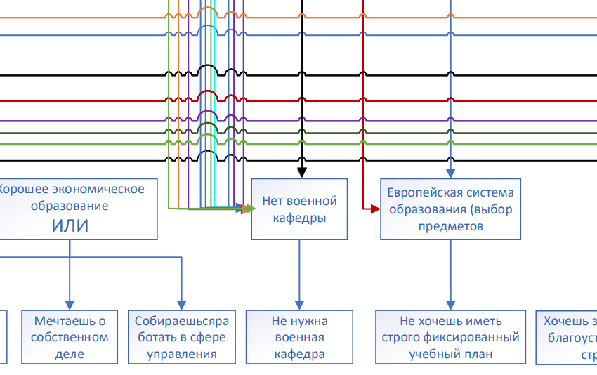

# Отчет по лабораторной работе
## по курсу "Искусственый интеллект"

### Студенты: 

| ФИО                         | Роль в проекте                                                                                    | Оценка       |
|-----------------------------|---------------------------------------------------------------------------------------------------|--------------|
| Лисин Роман Сергеевич       | Изменил оболочку ЭС преподавателя на Python, описал общую схему предметной области, написал отчёт |          |
| Мальцев Иван Денисович      | Инженер по знаниям, отвечал за описание вузов в дереве                                            |       |
| Фролов Михаил Александрович | Описывал вузы в дереве и сделал схему дерева в pdf                                                |      |


> *Комментарии проверяющих (обратите внимание, что более подробные комментарии возможны непосредственно в репозитории по тексту программы)*

## Тема работы

### Экспертная система по подбору ВУЗов в России

## Концептуализация предметной области

Мы выбрали 38 ВУЗов и выделили их основные характеристики: области, в которых вузы дают образование, тип образования (академическое, практическое), наличие военной кафедры, внеучебные активности и т.д.  Для того, чтобы выяснить, какие характеристики важны абитуриенту для каждой из них мы составили ряд условий, при которых характеристика становится обязательной к наличию у искомого ВУЗа. 
ВУЗы, их характеристики и условия учитывания характеристик при подборе представлены в виде дерева И-ИЛИ.
Полученная экспертная система обладает статической архитектурой, так как не имеет подсистему моделирования внешнего мира и подсистему связи с внешним окружением. 

Графическая иллюстрация:
https://github.com/MAILabs-Edu-2023/ai-lab-2-lisin-maltsev-frolov-2/blob/main/img/schema.pdf

## Принцип реализации системы

Мы используем механизм обратного вывода, чтобы человеку было проще подобрать ВУЗ. При таком 
механизме не надо задумываться о критериях выбора, а нужно просто отвечать да или нет. Также человек
может просто не знать все факторы выбора вуза.

В качестве программной реализации мы берём за основу код с лекции - https://github.com/shwars/AISchool/blob/master/notebooks/1%20Symbolic/Animals.ipynb,
поправив в нём несколько багов и изменив его путём добавления истории запросов для вывода всех подходящих ВУЗов. 


```python
queries_history = dict()


class Ask:
    def __init__(self, choices=['y', 'n']):
        self.choices = choices

    def ask(self):
        if max([len(x) for x in self.choices]) > 1:
            for i, x in enumerate(self.choices):
                print("{0}. {1}".format(i, x))
            x = int(input())
            return self.choices[x]
        else:
            ans = None
            while ans not in self.choices:  # обработка ответов, отличных от 'y', 'n'
                print("/".join(self.choices))
                ans = input()
            queries_history[list(queries_history.keys())[-1]] = ans  # сохраняем ответ в историю
            return ans

    ...
    
    class NoMoreUnivers(Exception):
        pass
    
    ...

    def eval(self, expr, field=None):
        if isinstance(expr, Ask):
            if field == "ВУЗ":  # в дереве нет подходящих вариантов
                raise NoMoreUnivers
            elif field in self.rules:  # если спрашиваем само правило, значит ответы на условия были 'n'
                return 'n'
            if field not in queries_history:  # если нет в истории, тогда спрашиваем
                queries_history[field] = None
                print(field)
                return expr.ask()
            else:
                return queries_history[field]

    ...

    universities = []
    try:
        while 3:  # пока не закончатся вузы
            kb = KnowledgeBase(rules)
            universities.append(kb.get('ВУЗ'))
            rules.pop(f"ВУЗ:{universities[-1]}")  # убираем вуз
    except NoMoreUnivers:
        ...
```

## Механизм вывода

Класс KnowledgeBase представляет собой экспертную систему и в конструкторе принимает словарь правил rules. Для того, чтобы описать правила
используется наследование классов If, AND, OR от класса Content. Это нужно, чтобы перенести дерево И-ИЛИ в код.
Далее мы вызываем метод get у объекта класса KnowledgeBase и ищем в словаре ключ, который начинается на "ВУЗ:". 
Это позволяет нам отделить обычные правила, от правил, которые являются искомыми (в нашем случае это вузы). После этого 
мы рекурсивно проверяем всё, что лежит в значении у элемента, который начинается на "ВУЗ:" с помощью метода eval. 
Если всё подходит, тогда и вуз нам этот подходит. Пользователь, вводя 'y' или 'n', определяет необходимость или справедливость условия для него.
Вопросы задаются с помощью класса Ask.


```python
class KnowledgeBase:
    def __init__(self, rules):
        self.rules = rules
        self.memory = {}

    def get(self, name):
        global queries_history
        if name in self.memory.keys():
            return self.memory[name]
        for fld in self.rules.keys():
            if fld == name or fld.startswith(name + ":"):
                # print(" + proving {}".format(fld))
                value = 'y' if fld == name else fld.split(':')[1]
                res = self.eval(self.rules[fld], field=name)
                if res == 'y':
                    self.memory[name] = value
                    return value
        # field is not found, using default
        res = self.eval(self.rules['default'], field=name)
        self.memory[name] = res
        return res

    def eval(self, expr, field=None):
        if isinstance(expr, Ask):
            if field == "ВУЗ":
                raise NoMoreUnivers
            elif field in self.rules:
                return 'n'
            if field not in queries_history:
                queries_history[field] = None
                print(field)
                return expr.ask()
            else:
                return queries_history[field]
        elif isinstance(expr, If):
            return self.eval(expr.x)
        elif isinstance(expr, AND) or isinstance(expr, list):
            expr = expr.x if isinstance(expr, AND) else expr
            for x in expr:
                if self.eval(x) == 'n':
                    return 'n'
            return 'y'
        elif isinstance(expr, OR):
            for x in expr.x:
                if self.eval(x) == 'y':
                    return 'y'
            return 'n'
        elif isinstance(expr, str):
            return self.get(expr)
        else:
            print("Unknown expr: {}".format(expr))
```

## Извлечение знаний и база знаний

Извлечение знаний по коду описано выше. 

Само дерево изначально строилось следующим образом. Сначала были выбраны основные критерии выбора вузы. 
Далее мы простыми вопросами подводим пользователя к выбору определённых факторов. По этим фактором уже можно выбрать вуз.

Самым интересным получилось правило про военную кафедру из-за формулировки вопроса. 



Рассмотрим ответы на вопрос "Не нужна военная кафедра?".
Ответ: "y" (да, не нужна). Следовательно, тут неважно, есть ли у вуза это правило.
А при ответе "n" (нет, нужна) если у вуза есть это правило, то он нам не подходит, что логично. 
И становится понятно, почему правило называется "Нет военной кафедры". В общем, получилось красивое
архитектурное решение.

## Протокол работы системы

Рекомендация человеку, который хочет изучать математику и информатику в топовом вузе: 
https://github.com/MAILabs-Edu-2023/ai-lab-2-lisin-maltsev-frolov-2/blob/main/examples/top_math_it.txt

Рекомендация человеку, который учится в химбио классе и хочет изучать иностранные языки:
https://github.com/MAILabs-Edu-2023/ai-lab-2-lisin-maltsev-frolov-2/blob/main/examples/medicine_himbio_languages.txt
## Выводы

В ходе лабораторной работы мы впервые познакомились с экспертными системами, научились строить дерево И-ИЛИ и реализовывать его в качестве экспертной системы на языке программирования Python. Самым сложным в работе было извлечение знаний для создания базы знаний, которая была бы не просто набором if-else, а настоящей экспертной системой, для этого мы вместе с командой собирались для просмотра отзывов об институтах и обговаривали точный набор характеристик каждого, позже уточняли их в чате, если появлялись вопросы. Наша команда использовала распределение обязанностей для наиболее эффективной работы.
