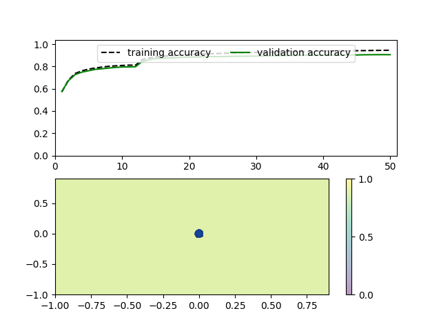

[](https://classroom.github.com/online_ide?assignment_repo_id=10795573&assignment_repo_type=AssignmentRepo)
# Лабораторная работа по курсу "Искусственный интеллект"
# Создание своего нейросетевого фреймворка

### Студенты: 

| ФИО                         | Роль в проекте           | Оценка       |
|-----------------------------|--------------------------|--------------|
| Лисин Роман Сергеевич       | Руководил, программировал |          |
| Фролов Михаил Александрович | Программировал           |       |
| Мальцев Иван Денисович      | Писал отчёт              |          |

> *Комментарии проверяющего*

### Отчет

В данной лабораторной работе перед нами стояла задача реализации нейросетевого фреймворка для обучения полносвязных нейросетей.

В файле perceptron.py приведена реализация нашего фреймворка. В нем описаны все классы, необходимые для создания и обучения нейронной сети.

Саму нейронную сеть описывает класс Net, в котором описана инициализация, а также методы добавления линейного слоя или передаточной функции, прямого прохода, обратного прохода и метод для обновления значений весов путем минимизации функции потерь.

Линейные слои инициализируются в классе Linear . Для этого в функцию инициализации передаются два значения - nin и nout, которые показывают, сколько входов и сколько выходов должен иметь определяемый слой. На основе этих значений происходит инициализация начальных весов W и b.
При прямом проходе используется функция forward в классе Linear, которая принимает входные данные и возвращает logits, то есть ненормированные значения, которые дают неточную информацию о принадлежности элемента датасета к какому-то классу. Чтобы получить более точную информацию, необходимо рассчитать ошибку и минимизировать функцию потерь. Однако для определения ошибки используют не logits, а вероятности. Также, если передавать между слоями logits, последовательное применение линейных слоёв эквивалентно применению одного линейного слоя, поэтому в этом случае тоже нужно перейти к вероятностям.
Для преобразования logits в вероятности применяются передаточные функции. В нашей работе реализованы следующие функции:  
***Softmax***  
```python
class Softmax:

    def forward(self, z):
        self.z = z
        zmax = z.max(axis=1, keepdims=True)
        expz = np.exp(z - zmax)
        Z = expz.sum(axis=1, keepdims=True)
        return expz / Z

    def backward(self, dp):
        p = self.forward(self.z)
        pdp = p * dp
        return pdp - p * pdp.sum(axis=1, keepdims=True)
```
***Tanh***   
```python
class Tanh:

    def forward(self, x):
        y = np.tanh(x)
        self.y = y
        return y

    def backward(self, dy):
        return (1.0 - self.y ** 2) * dy
```
***ReLU***  
```python
class ReLU:

    def forward(self, input):
        self.input = input
        self.output = np.maximum(input, 0)
        return self.output

    def backward(self, dy):
        mask = self.input > 0
        return np.multiply(dy, mask)
```

В качестве функции потерь мы можем использовать функцию 0-1 loss и логарифмическую функцию ошибки для задач бинарной классификации, а для задач регрессии - среднеквадратичную ошибку.  
***0-1 loss***  
```python
def zero_one(d):
    if d < 0:
        return 1
    return 0
```
***Логарифмическая функция ошибки***  
```python
def logistic_loss(fx):
    # assumes y == 1
    y = 1
    return 1 / np.log(2) * np.log(1 + np.exp(-y * fx))
```
***Среднеквадратичная ошибка*** 
```python
x = np.linspace(-2, 2, 101)
loss_funcs_regression = [np.abs(x), np.power(x, 2)]
```

Для задач мультиклассовой классификации используется функция Cross-Entropy Loss. Ее идея в том, что вывод модели представляется как распределение вероятностей появления того или иного класса. Мы знаем какой класс должен появиться, поэтому считаем минус логарифм от вероятности появления этого класса. Это и будет значение ошибки.
```python
class CrossEntropyLoss:

    def forward(self, p, y):
        self.p = p
        self.y = y
        p_of_y = p[np.arange(len(y)), y]
        log_prob = np.log(p_of_y)
        return -log_prob.mean()

    def backward(self, loss):
        dlog_softmax = np.zeros_like(self.p)
        dlog_softmax[np.arange(len(self.y)), self.y] -= 1.0 / len(self.y)
        return dlog_softmax / (np.clip(self.p, 1e-8, 1 - 1e-8))  # Fix ZeroDivisionError
```
После вычисления функции потерь пытаемся ее минимизировать. Для этого будем рассматривать функцию потерь как функцию от W и b. Мы должны подстроить веса так, чтобы значение функции уменьшилось. Сделать это можно, применив один из трех, реализованных у нас, методов оптимизации.
В методе градиентного спуска (SGD) мы просто постепенно спускаемся к точке минимума, идя в направлении антиградиента.
Метод инерции (Momentum) действует примерно как SGD, только позволяет не останавливаться в точках локальных минимумов за счет того, что учитываются предыдущие градиенты.
Оптимизатор RMSProp похож на метод инерции. Он позволяет усреднить скорость изменения значений в векторе весов.  
***SGD***  
```python
 def sgd(self, lr):
        self.W -= lr * self.dW
        self.b -= lr * self.db
```

***Momentum***  
```python
def momentum(self, lr):
        self.v_W = 0.9*self.v_W + 0.1*lr*self.dW
        self.v_b = 0.9*self.v_b + 0.1*lr*self.db
        self.W -= self.v_W
        self.b -= self.v_b
```
***RMSProp***
```python
def rmsp(self, lr):
        self.G_W = 0.9*self.G_W + 0.1*np.square(self.dW)
        self.G_b = 0.9*self.G_b + 0.1*np.square(self.db)
        self.G_W[:] += 1e-8
        self.G_b[:] += 1e-8
        self.W -= lr*np.divide(self.dW, np.sqrt(self.G_W))
        self.b -= lr*np.divide(self.db, np.sqrt(self.G_b))
```

***Обработка оптимизаторов***
```python
def update(self, lr, optimizer):
    for l in self.layers:
        if optimizer in l.__dir__():
            if optimizer == "sgd":
                l.sgd(lr)
            elif optimizer == "momentum":
                l.momentum(lr)
            elif optimizer == "rmsp":
                l.rmsp(lr)
```

Во всех методах оптимизации необходимо вычислять производную функции потерь по W и по b. Это сложная функция, поэтому нужно использовать правило дифференцирования сложной функции, то есть искать производные всех функций перехода и функций, применяемых в каждом линейном слое. Для этого в классах Linear, CrossEntropyLoss и в классах передаточных функций созданы методы backward. В классе Net также создан метод backward, который последовательно для каждого слоя и для каждой передаточной функции в сети запускает метод backward, определенный в соответствующем классе.

Теперь рассмотри класс Learner, который отвечает за обучение нейросети. Его конструктор принимает на вход слои нейросети и передаточные функции, что является очень удобным для обучения и конфигурирования нейросетей.
В метод train_and_plot передается все необходимое для обучения нейросети: обучающая и тестовая выборки, число эпох, функция потерь, оптимизатор для функции потерь, размер батча и скорость обучения. Внутри функции train_and_plot вызывается функция train_epoch. В train_epoch мы разбиваем обучающую выборку на батчи и для каждого батча проходимся в прямом и обратном направлениях с последующим изменением весов.
Функция train_and_plot также визуализирует процесс обучения. Она рисует график изменения точности для обучающей и для тестовой выборки, а также поверхность принятия решений.
Одной из наиболее важных частей класса Learner является метод predict, который пытается классифицировать передаваемые в метод данные путем прямого прохода по нейронной сети.
Видно, что процесс конструирования и обучения нейросети достаточно прост и обладает гибкой возможностью конфигурирования.

```python
class Learner:

    def __init__(self, *args):
        self.net = Net()
        for layer in args:
            self.net.add(layer)

    def train_and_plot(self, train_x, train_y, test_x, test_y, n_epoch, loss=CrossEntropyLoss(), optimizer="sgd",
                       batch_size=4, lr=0.1):
        res = train_and_plot(train_x, train_y, test_x, test_y, n_epoch, self.net, loss, optimizer, batch_size, lr)
        print(f'Train loss: {res[0][-1][1]}, accuracy = {res[0][-1][2]}')
        print(f'Test loss: {res[1][-1][1]}, accuracy = {res[1][-1][2]}')
        return res

    def predict(self, data):
        y_pred = self.net.forward(data)
        print('Prediction:', np.argmax(y_pred, axis=1)[0])
```

Для каждого датасета создан отдельный класс. Они хранятся в файле datasets.py.
В классе ClassDataset генерируется случайный датасет с помощью make_classification, а затем разбивается на обучающую и тестовую выборки.
```python
class ClassDataset:

    def __init__(self, n=1000):
        self.n = n
        X, Y = make_classification(n_samples=n, n_features=2,
                                   n_redundant=0, n_informative=2, flip_y=0.2)
        self.X = X.astype(np.float32)
        self.Y = Y.astype(np.int32)

    def train_test_split(self):
        train_x, test_x = np.split(self.X, [self.n * 8 // 10])
        train_y, test_y = np.split(self.Y, [self.n * 8 // 10])
        return train_x, train_y, test_x, test_y
```

Для датасета MNIST создан класс Mnist. Перед началом работы с этим датасетом его нужно скачать, используя команды из комментариев. Класс содержит методы для инициализации датасета, его разбиения на обучающую и тестовую выборки и метод для демонстрации элемента датасета по индексу.
```python
class Mnist:

    def __init__(self, limit=100):
        """
        curl -o mnist.pkl.gz https://raw.githubusercontent.com/shwars/NeuroWorkshop/master/Data/MNIST/mnist.pkl.gz
        gzip -d mnist.pkl.gz
        """
        with open('neuro_learner/mnist.pkl', 'rb') as f:
            self.MNIST = pickle.load(f)
        self.labels = self.MNIST['Train']['Labels']
        self.features = self.MNIST['Train']['Features']

    def show_number_by_position(self, position):
        pylab.imshow(self.features[position].reshape(28, 28))
        print(self.labels[position])
        pylab.show()

    def train_test_split(self):
        return train_test_split(self.features, self.labels, train_size=0.9)
```

Чтобы легко начать работу с нашим фреймворком в проекте имеется файл requirements.txt. Достаточно выполнить в консоли команду pip install -r requirements.txt для установки зависимостей.

Посмотрим, как фреймворк работает с датасетом из класса ClassDataset.

```python
from neuro_learner.perceptron import Learner, Linear, Tanh, Softmax, CrossEntropyLoss
from neuro_learner.datasets import ClassDataset

learner = Learner(Linear(2, 5), Tanh(), Linear(5, 2), Softmax())
loss = CrossEntropyLoss()
train_x, train_y, test_x, test_y = ClassDataset().train_test_split()

# print("Initial loss={}, accuracy={}: ".format(*get_loss_acc(train_x, train_labels)))
res = learner.train_and_plot(train_x, train_y, test_x, test_y, n_epoch=30, loss=loss, lr=0.01)
```

В класс Learner последовательно передаются слои и передаточные функции. Далее в качестве функции потерь выбирается Cross Entropy Loss и производится разбиение датасета на обучающую и тестовую выборки.  После этого происходит обучения нейросети методом train_and_plot класса Learner. После выполнения всех этих этапов мы получаем график изменения точности и поверхность принятия решений. В консоли печатаются значения функции потерь и точность для обучающей и тестовой выборки. Отметим, что для удобства в фреймворк добавлена полоска, показывающая время обучения нейросети.

 

Теперь поглядим на то, как этот фреймворк работает на датасете MNIST. 
```python
import pylab
from neuro_learner.perceptron import Learner, Linear, ReLU, Softmax, CrossEntropyLoss
from neuro_learner.datasets import Mnist

learner = Learner(Linear(784, 128), ReLU(), Linear(128, 32), ReLU(), Linear(32, 10), Softmax())
loss = CrossEntropyLoss()
train_x, test_x, train_y, test_y = Mnist().train_test_split()

res = learner.train_and_plot(train_x, train_y, test_x, test_y, n_epoch=50, loss=loss, batch_size=16, lr=0.00001)

# Prediction of model
picture = test_x[228]
pylab.imshow(picture.reshape(28, 28))
learner.predict(picture)
pylab.show()
```

Помимо обучения сети мы используем метод predict из класса Learner, чтобы проверить, как нейросеть справляется с определением цифры, изображенной на картинке, после обучения. В нашем примере нейросеть должна определить значение цифры, изображенной на 229-ой картинке датасета. И она справляется с этим, верно распознавая цифру 7 (результат выводится в консоль)!
 




Таким образом, результатом данной лабораторной работы стал нейросетевой фреймворк для обучения полносвязных сетей. В процессе его создания мы узнали как построить нейронную сеть и обучить её методом обратного распространения ошибки.
