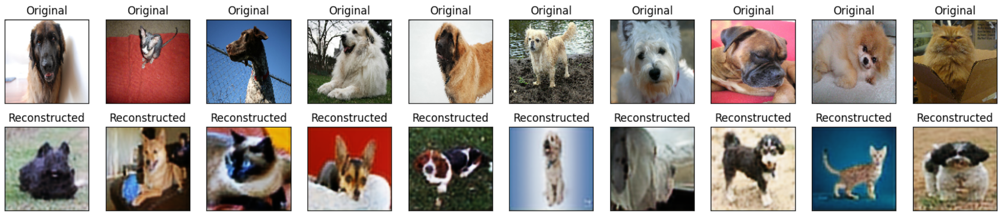

# Отчёт по лабораторной работе
## Свёрточные нейронные сети

### Студенты: 

| ФИО       | Роль в проекте                     | Оценка       |
|-----------|------------------------------------|--------------|
| Лисин Роман Сергеевич | Выполнил задания 1, 2 |          |
| Фролов Михаил Александрович | Выполнил задания 1, 2 |       |
| Мальцев Иван Денисович | Выполнил задание 3 |      |

> *Комментарии проверяющего*

# Задание 1

Мы пробовали много разных конфигураций модели: меняли количество и параметры сверточных слоев, добавляли больше линейных слоев, меняли лернинг рейт и количество эпох. По итогу модель из ноутбука оказалась самой лучшей по метрикам. 
Итоговое количество эпох - 50.  Подробнее можно посмотреть в Faces.ipynb.

Точность двоичной классификации "кошки против собак" на тестовом датасете - 0.956386292834891.

# Задание 2

Лучшая точность оказалось у сети ResNet. Количество эпох для всех сетей - 10. Подробнее можно посмотреть в Pets.ipynb.

Точность ResNet двоичной классификации "кошки против собак" на тестовом датасете - 0.9910057236304171.

VGG-16

VGG-19

ResNet

# Задание 3

В качестве генеративной модели мы использовали автоэнкодер.

Автоэнкодер преобразует входное изображение в некоторое скрытое состояние меньшей размерности, а затем пытается восстановить из него исходную картинку.

Изначально мы генерировали изображения размером 64x64 пикселей.

Далее были сгенерированы изображения размером 128x128 пикселей.

А вот изображения размером 256x256 сгенерировать не удалось из-за проблем с выделением памяти.
