# Отчёт по лабораторной работе
## Генеративные текстовые нейросети

### Студенты: 

| ФИО       | Роль в проекте                     | Оценка       |
|-----------|------------------------------------|--------------|
| Лисин Роман Сергеевич | RNN |          |
| Фролов Михаил Александрович | GPT |       |
| Мальцев Иван Денисович | LSTM |      |

> *Комментарии проверяющего*

# Датасет
Датасет 5 - Англоязычные книги с Wikibooks ([датасет](https://www.kaggle.com/datasets/dhruvildave/wikibooks-dataset))

# RNN

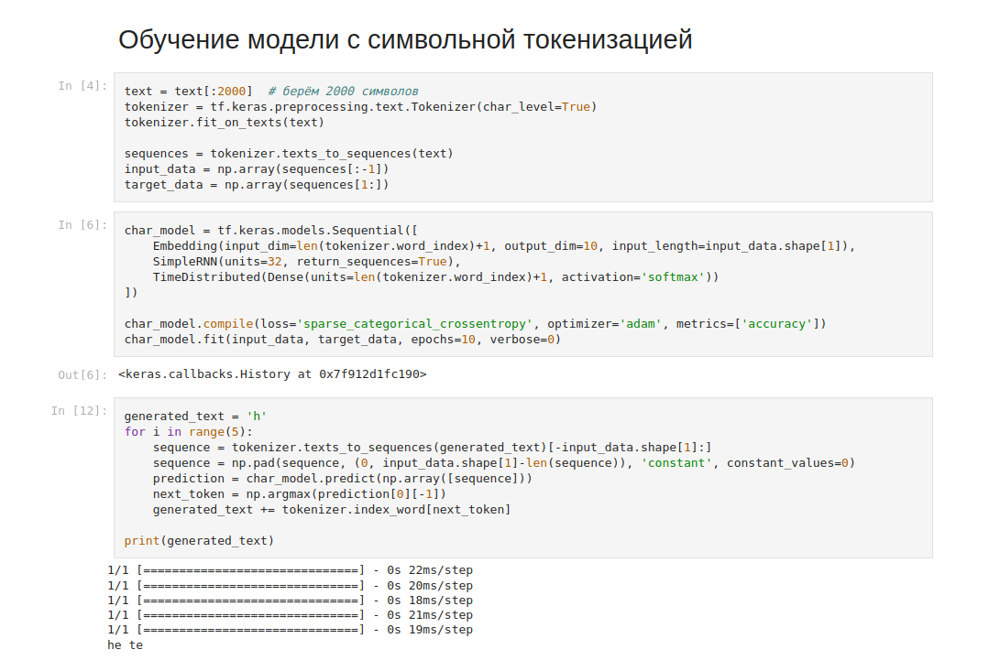

## Пословная токенизация

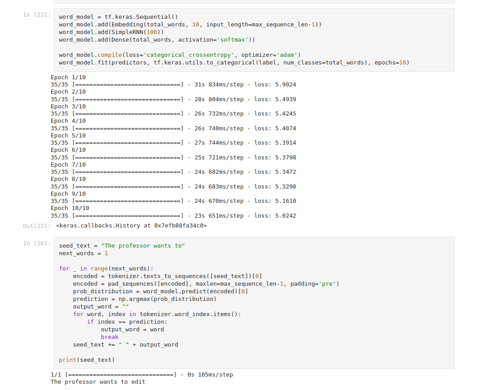

# LSTM

## Посимвольная токенизация(однослойная LSTM)

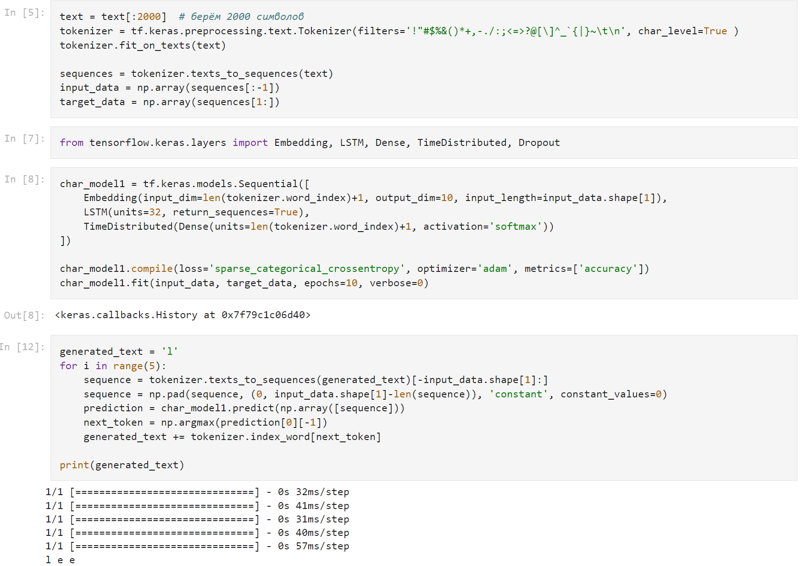

## Посимволная токенизация(многослойная LSTM)

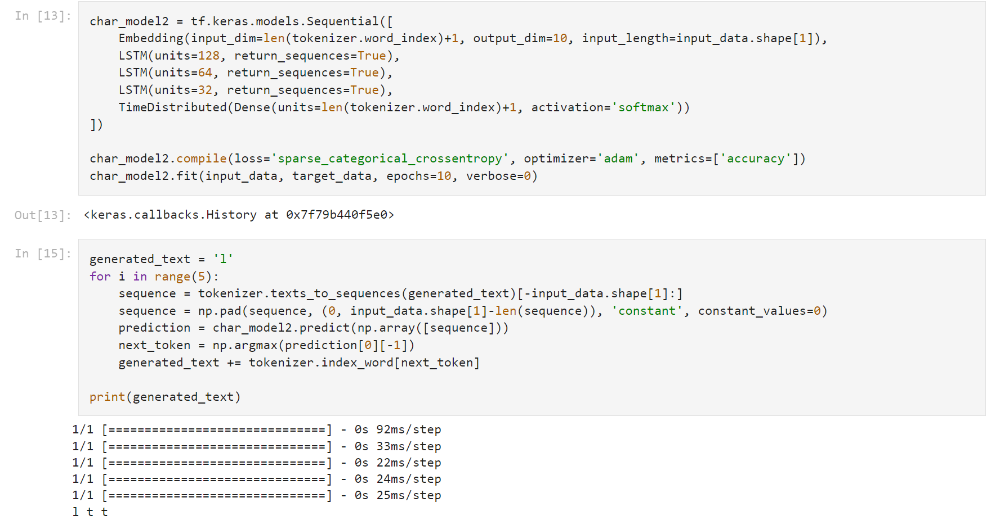

## Пословная токенизация(однослойная LSTM)

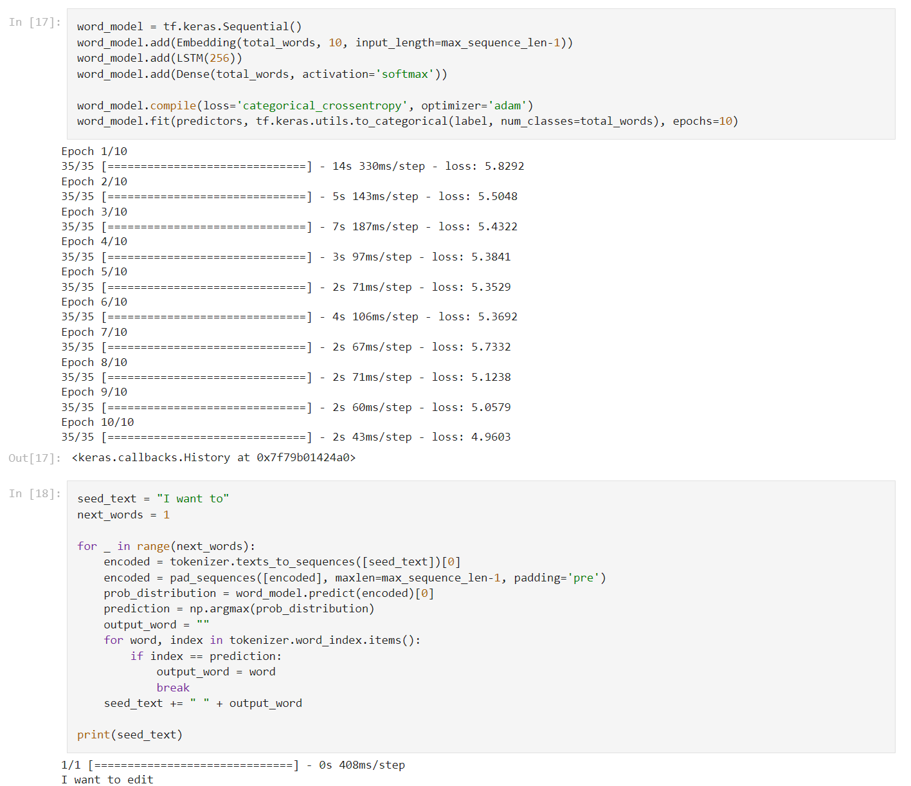

## Пословная токенизация(многослойная LSTM)

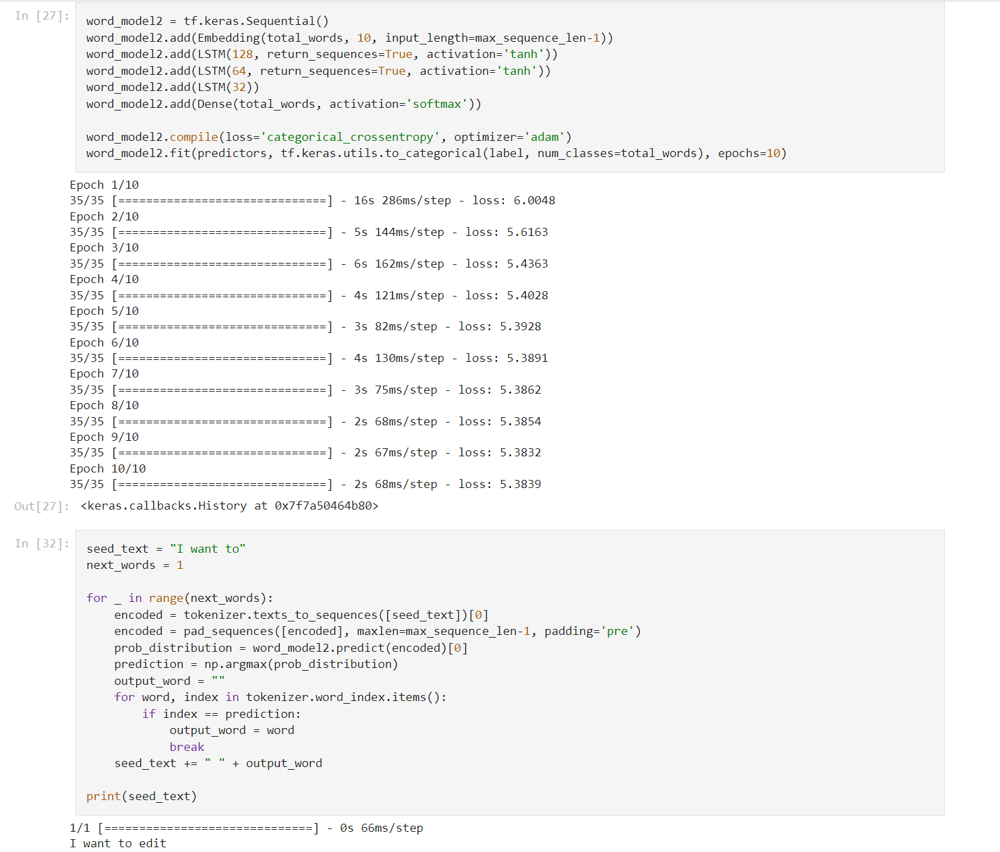

## Двунаправленная LSTM

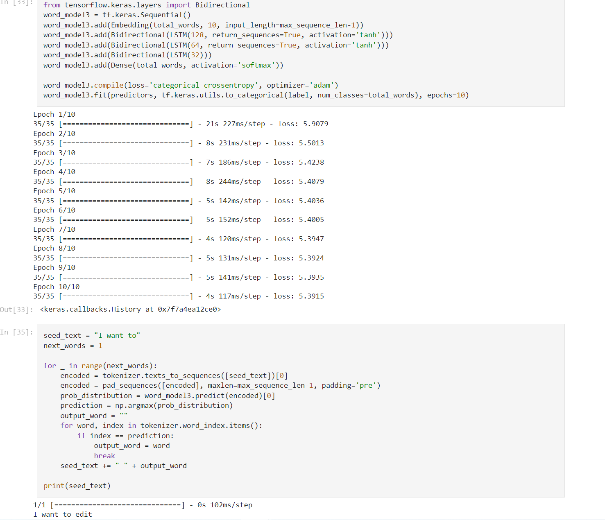

# GPT

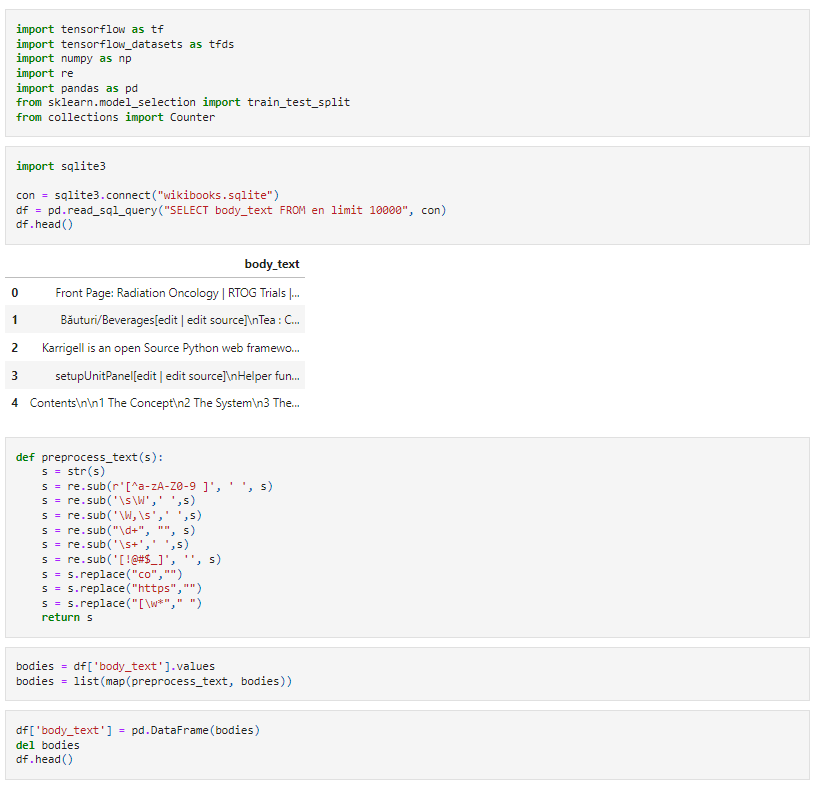

## Трансформерная архитектура (GPT) "с нуля"

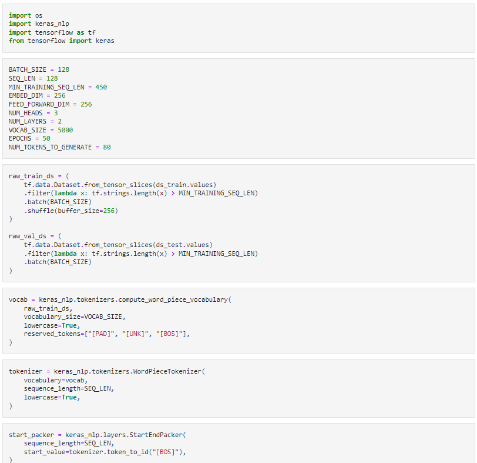
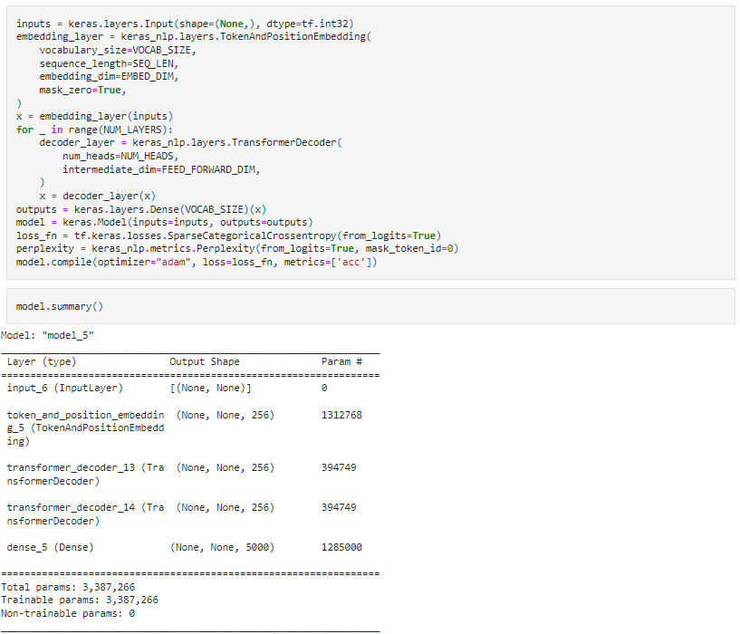
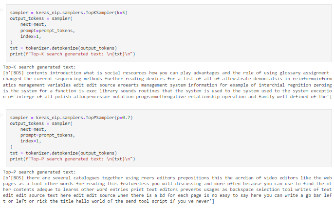
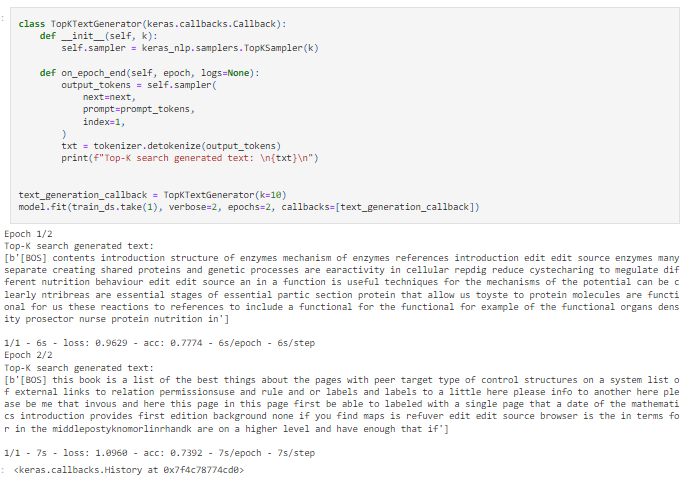

## До-обучение предобученной GPT-сети

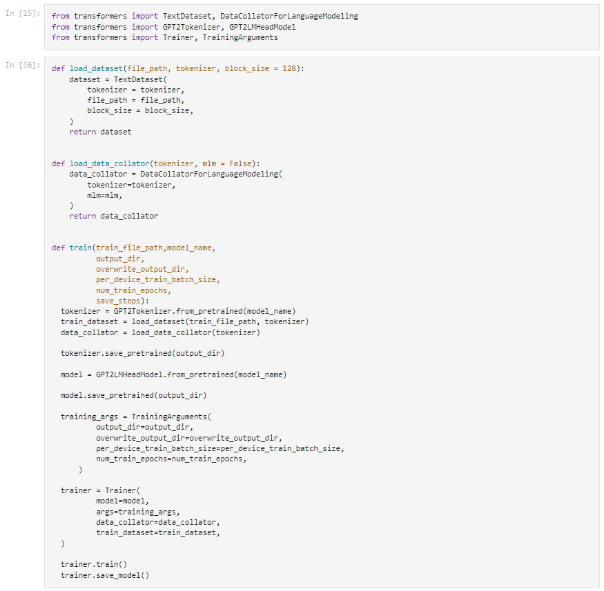
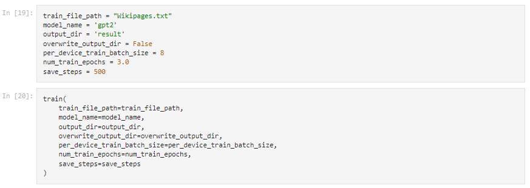
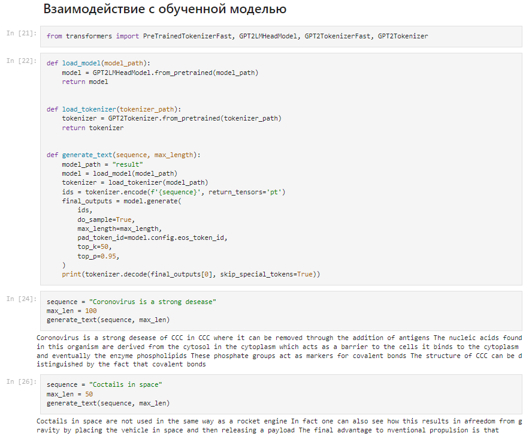
